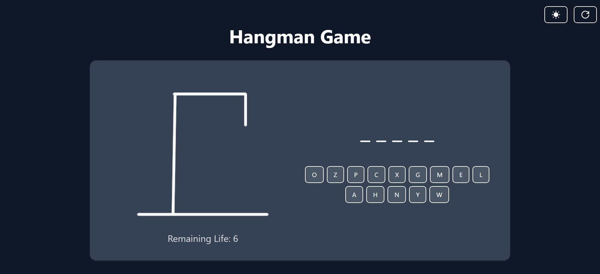
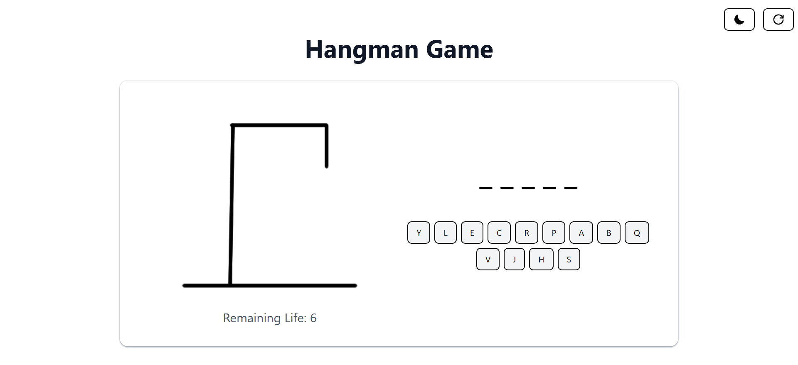
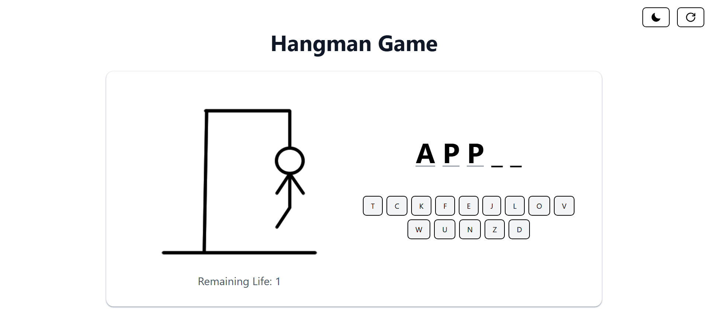
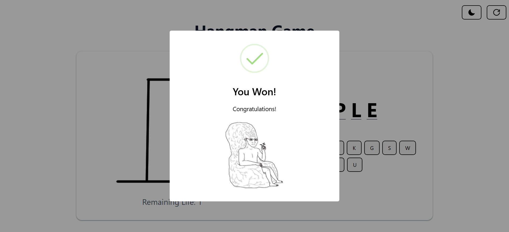
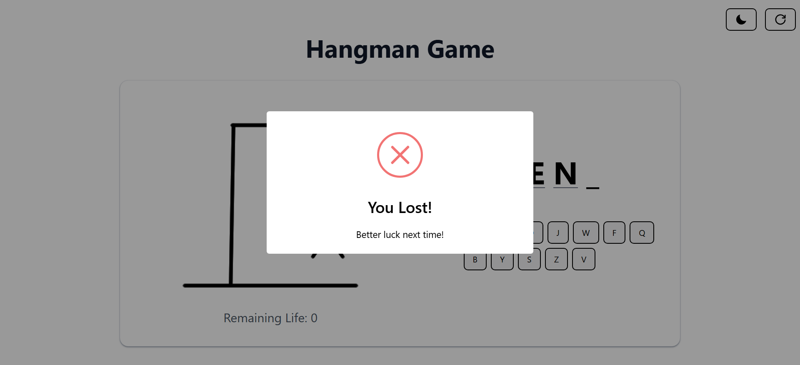

# 🎮 Hangman Game

Bu proje, klasik "Adam Asmaca" oyununu modern bir yaklaşımla React kullanarak yeniden hayata geçirdiğim bir web uygulamasıdır. Amacım, hem React'teki bilgi birikimimi artırmak hem de eğlenceli ve kullanıcı dostu bir deneyim sunmaktı.

## 🕹️ Oyun Özellikleri

- **Kelime Tahmin Oyunu:** 
  Her sayfa yenilendiğinde veya “Reset” butonuna basıldığında, kelime haznesinden rastgele bir kelime seçilir. Oyuncunun 6 tahmin hakkı vardır. Yanlış tahminlerde can azalır, doğru tahminlerde kelime tamamlanır.

- **Tema Desteği:**
  Sağ üst köşedeki butonla karanlık/aydınlık temalar arasında geçiş yapılabilir. Seçilen tema, `localStorage`'da saklanır ve böylece kullanıcı deneyimi süreklilik kazanır.

- **Responsive Tasarım:**
  Mobil, tablet ve masaüstü cihazlarda sorunsuz çalışacak şekilde tasarlandı. Her cihazda oynanabilir keyifli bir deneyim sunar.

- **Dinamik Harf Butonları:**
  Her tahminde harf butonları farklı şekilde sıralanır. Bu, oyuna ek bir zorluk ve rastgelelik katar.

- **Oyun Sonu Bildirimleri:**
  SweetAlert2 ile oyun kazanıldığında veya kaybedildiğinde kullanıcıya görsel ve etkileyici bildirimler sunulur.

## 📸 Ekran Görüntüleri







## 🧰 Kullanılan Teknolojiler

- **React:** Bileşen tabanlı yapı ile hızlı ve dinamik UI geliştirme.
- **Tailwind CSS:** Hızlı, modern ve responsive stillendirme için.
- **SweetAlert2:** Estetik ve kullanıcı dostu bildirimler için.
- **LocalStorage:** Tema tercihlerini ve oyun durumunu saklamak için.

## ⚙️ Kurulum ve Çalıştırma

Projeyi kendi bilgisayarınızda çalıştırmak için:

```bash
git clone https://github.com/furkan-karapinar/Hangman-Game-React.git
cd Hangman-Game-React
npm install
npm run dev
